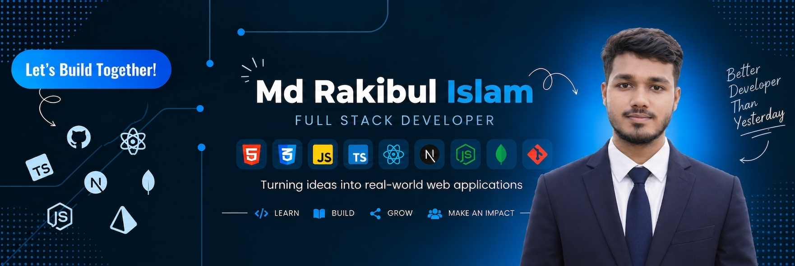

<!-- ====================================================== -->
<!--                       BANNER                           -->
<!-- ====================================================== -->

  

<!-- ====================================================== -->
<!--                       INTRO                            -->
<!-- ====================================================== -->

<h1 align="center">
  Hi 👋, I'm Md Rakibul Islam
</h1>

<!-- ====================================================== -->
<!--                  TYPING ANIMATION                     -->
<!-- ====================================================== -->

  

<!-- ====================================================== -->
<!--                      ABOUT ME                          -->
<!-- ====================================================== -->

## 👨‍💻 About Me

- 👋 Hi, I’m [@rakibul-024](https://github.com/rakibul-024)
- 🌱 I’m currently learning **full stack web development**
  
- 🔭 I’m currently working on **React.js, Next.js, TypeScript and Redux for frontend development.**

- 💬 Ask me about **Full-Stack (React, Next, Node, Express, MongoDB, PostgreSQL).**

- 👨‍💻 All of my projects are available at [My Portfolio](https://rakibul-024.github.io/My-Portfolio/)

- 📝 I regularly write articles on [LinkedIn](https://www.linkedin.com/in/md-rakibul-islam-155108343/)

- 📫 How to reach me **rakibulislam206924@gmail.com**

- 📄 Know about my experiences [View My Resume](https://drive.google.com/file/d/1zkZtmcYyCE7bGiO0dJMEihVhdCIbQy9F/view?usp=sharing)

---

<!-- ====================================================== -->
<!--                FOLLOW ME ON SOCIALS                    -->
<!-- ====================================================== -->

# 🌐 FOLLOW ME ON SOCIALS

  

  

  

  

  <b>🚀 Keep Learning • Keep Building • Keep Growing</b>

---

<!-- ====================================================== -->
<!--                  TECHNOLOGY STACK                      -->
<!-- ====================================================== -->

# 🛠️ TECHNOLOGY STACK

## 🌐 Languages

## ⚛️ Frontend Development

## ⚙️ Backend Development

## 🗄️ Database

## 🔧 Tools

---

<!-- ====================================================== -->
<!--             GITHUB STATISTICS & ANALYSIS               -->
<!-- ====================================================== -->

# 📊 GitHub Statistics & Analysis

## GitHub Contributions:

 

  ### 📈 GitHub Statistics:

  <!-- Dynamic GitHub Profile Summary -->
  

   
   

  <!-- Top Languages Summary -->
  
  &nbsp;
  

<!-- ====================================================== -->
<!--                Repository Stats & Streak:                 -->
<!-- ====================================================== -->

## 🔥 Repository Stats & Streak:

  

---

<!-- ====================================================== -->
<!--                    RANDOM DEV QUOTE                    -->
<!-- ====================================================== -->

# 💭 Random Dev Quote

> **"Always code as if the person who ends up maintaining your code will be a violent psychopath who knows where you live." — John F. Woods** 💻

---

<!-- ====================================================== -->
<!--                    PROFILE VIEWS                       -->
<!-- ====================================================== -->

  

